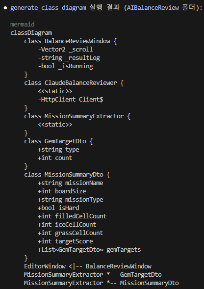
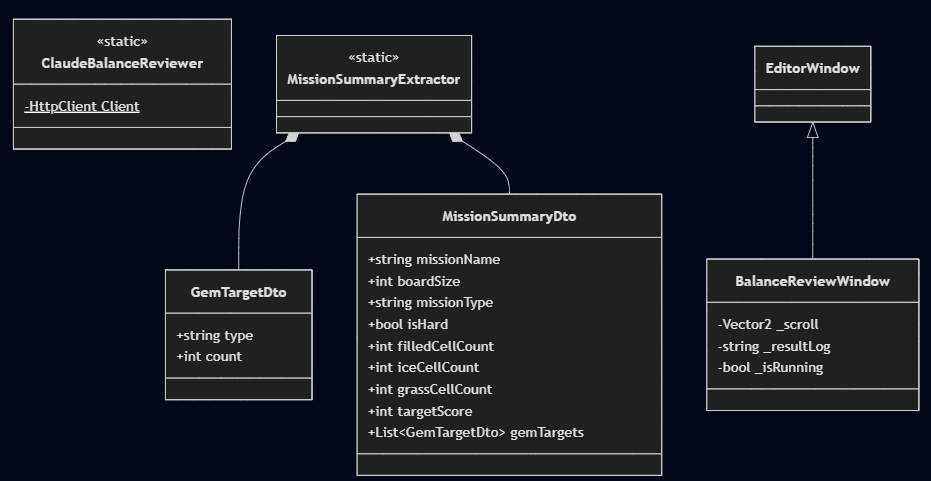

# generateclassdiagram
C# 소스 폴더를 분석해서 Mermaid `classDiagram` 텍스트 생성하는 MCP 서버

## 왜 만들었나
Claude에게 클래스 다이어그램을 그냥 읽고 그려달라고 할 수도 있지만
파일이 많아질수록 비용이 커지고 호출마다 결과가 흔들릴 수 있음
이 프로젝트는 결정론적인 파싱(`tree-sitter`) 파이프라인을 도구로 캡슐화해서 그 문제를 없앰

**목표**
1. 파이썬으로 실전 프로젝트 하나 구현
2. MCP 서버의 도구 설명/에러 처리/권한 범위 구현 연습
    - 도구 설명(`docstring`)을 모델이 오용하지 않게 쓰는 법
    - 실패를 클라이언트가 읽을 수 있는 형태로 돌려주는 법
    - 모델이 채우는 입력값(`path`)을 신뢰하지 않고 서버 쪽에서 접근 범위를 강제하는 법
---
## 데모

Claude Code에서 호출한 결과

| 필드/프로퍼티까지 포함한 다이어그램 출력 | mermaid.live 렌더링 |
|---|---|
|  |  |

가드 테스트 결과


`_MAX_CS_FILES`를 5로 설정해두고 파일 수 상한 테스트


---
## 파이프라인

```plaintext
.cs 파일들
   │  tree-sitter로 구문 트리 파싱
   ▼
csharp_parser.py  ──▶  model.py의 ParsedClass 목록 (dataclass)
   │  선언 종류 / 이름 / 접근 제어자 / 상속·구현 / 중첩 / 필드·프로퍼티
   ▼
emitter.py  ──▶  Mermaid classDiagram 텍스트
   ▼
server.py (MCP tool: generate_class_diagram)
```

- **model.py**
    - 파서와 emitter가 주고받는 자료구조
    - `ParsedClass`/`Field`/`Property`/`Method` 등 dataclass와 `ClassKind`/`AccessModifier`/`RelationKind` enum으로 구성
- **csharp_parser.py**
    - `tree-sitter-c-sharp`로 폴더 내 `.cs` 파일을 파싱해 `ParsedClass` 목록으로 변환
    - 정규식으로 먼저 시도했다가(괄호 중첩/다중 줄/주석 안 키워드 문제로) tree-sitter로 교체
- **emitter.py**: `ParsedClass` 목록을 Mermaid `classDiagram` 문법 텍스트로 직렬화
- **server.py**: MCP 도구 하나(`generate_class_diagram`) 노출, 경로 검증과 에러 번역 담당
---
## 경로 접근 범위

MCP 도구의 `path` 인자는 사용자가 아니라 모델이 채우는 값이라 신뢰할 수 없는 입력임
처음에는 `is_dir()` 검사만 있어서 `C:\Windows\System32` 같은 임의 경로도 그대로 순회함

**해결 방안**
- `GENERATECLASSDIAGRAM_ROOTS` 환경변수로 허용 루트 폴더 목록을 지정(미지정 시 서버 실행 폴더만 허용)
  유효한 폴더가 하나도 없으면 서버가 기동 시점에 죽음(조용히 열어두지 않음)
- 매 호출마다 `Path(path).expanduser().resolve()`로 정규화한 뒤 허용 루트 안인지 검사
  → `..`로 상위 폴더를 탈출하려는 시도도 `resolve()`가 먼저 풀어버려서 막힘
- `.cs` 파일 수 상한(2000개)으로 거대한 드라이브 전체를 훑는 것 방지
- 의도된 실패(범위 밖/폴더 없음/파일 수 초과)는 MCP SDK의 `ToolError`로 던져서 우리 메시지가 그대로 클라이언트에 전달되게 함
    이게 아니면 클라이언트엔 `"Error executing tool ..."`라는 고정 문구만 가고 모델이 무엇이 잘못됐는지 몰라 교정하지 못함

---

## 지원 범위

| 항목 | 상태 |
|---|---|
| 클래스 / 인터페이스 / 구조체 / 열거형 선언 | ✅ |
| 상속, 인터페이스 구현, 중첩 관계 | ✅ |
| 필드, 프로퍼티 멤버 | ✅ |
| 경로 접근 범위 제한 / 파일 수 상한 | ✅ |
| 메서드 | 🚧 진행 중 |
| 연관·의존 등 나머지 관계 | 🚧 진행 중 |

## 기술 스택

- 언어: Python 3.14
- MCP: 공식 Python SDK (mcp[cli])
- 파싱: tree-sitter (C# 문법)
- 패키징/실행: uv
- 출력: Mermaid classDiagram

## 개발 기록

단계별 진행 과정 및 학습 내용을 [docs/과정.md](docs/과정.md), [AI-Tooling-Study](https://github.com/chlghksgml01/AI-Tooling-Study)에 기록

---
## 설치 및 사용

**요구사항**
- Python 3.14+
- uv
- Claude Code(또는 다른 MCP 클라이언트)

**1. 다운로드**
```bash
git clone https://github.com/chlghksgml01/generateClassDiagram.git
```

**2. 의존성 설치**
```bash
cd generateClassDiagram
uv sync # 프로젝트 전용 가상환경, 필요한 패키지 설치
```

**3. Claude Code에 등록**

```bash
claude mcp add generateclassdiagram --scope project -e GENERATECLASSDIAGRAM_ROOTS="다이어그램뽑고싶은실제프로그램경로" -- uv run --directory "이서버코드위치" generateclassdiagram
```
- 평소 Claude Code를 열어서 쓸 폴더에서 실행(다이어그램 대상 프로젝트일 수도,
  이 서버 코드 자체일 수도, 그 외 아무 작업 폴더일 수도 있음 — 다이어그램 대상인지 여부와는 무관)
- .mcp.json 생성됨
```json
{
  "mcpServers": {
    "generateclassdiagram": {
      "type": "stdio",
      "command": "uv",
      "args": ["run", "--directory", "이서버코드위치", "generateclassdiagram"],
      "env": {
        "GENERATECLASSDIAGRAM_ROOTS": "다이어그램뽑고싶은실제프로그램경로"
      }
    }
  }
}
```

**4. 확인**

`.mcp.json`이 있는 위치에서 Claude Code를 새로 열고 `/mcp`로 `generateclassdiagram` 연결 확인

**5. 사용**

Claude Code에서:

> generate_class_diagram을 이용해 "다이어그램뽑고싶은실제프로그램경로" 클래스 다이어그램 그려줘

도구가 반환하는 텍스트 예시:

```
classDiagram
    class MissionSummaryExtractor {
        +List~GemTargetDto~ Targets
    }
    IExtractor <|.. MissionSummaryExtractor
```

이 텍스트를 [mermaid.live](https://mermaid.live)에 붙여넣으면 바로 렌더링됨

**테스트(개발용)**
```bash
uv run pytest
```
