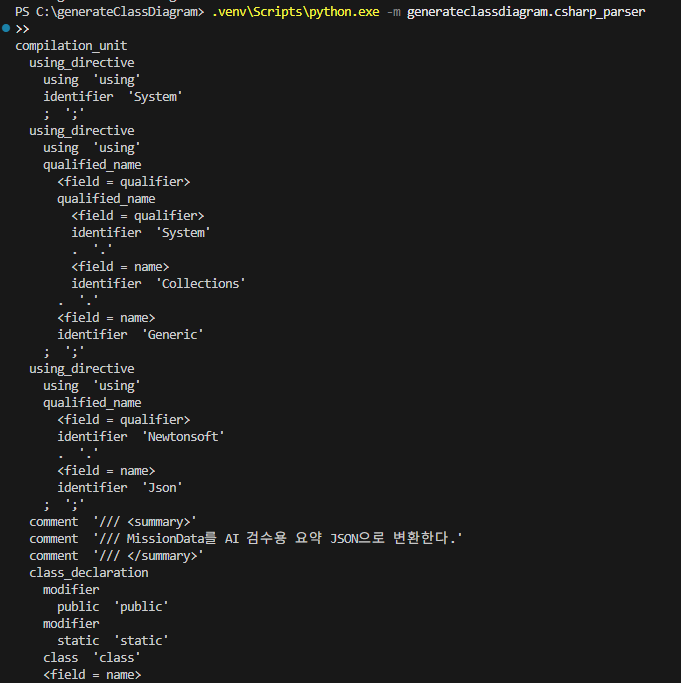
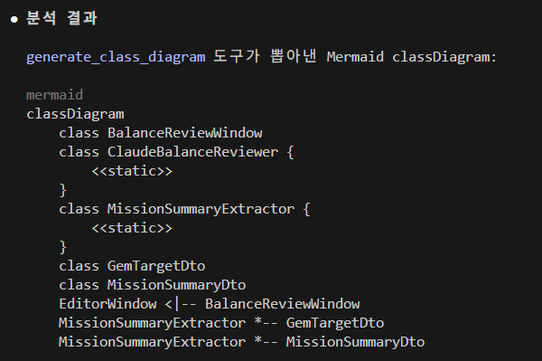
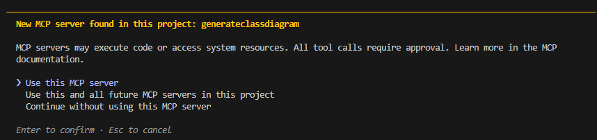
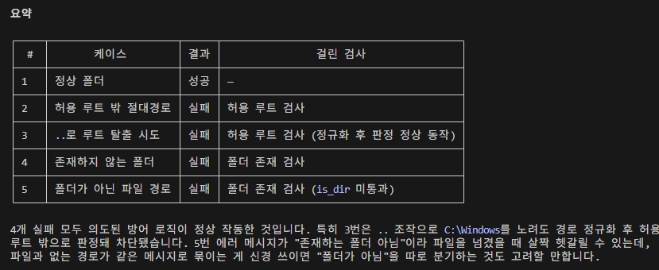
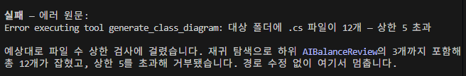

## 프로젝트 초기화
### 1. uv init weather
 
## MCP SDK + 테스트 도구 설치
### 2. uv add "mcp[cli]>=2.1.1"
    - MCP SDK(AI모델, 로컬도구 연결) 및 mcp 커맨드(개발/디버깅용 CLI 도구) 설치
    - `>=2.1.1`: mcp 패키지의 최소 버전 지정
### 3. uv add --dev "pytest>=8"
    - pytest 프레임워크(버그없이 잘 작동하는지 검증해주는 도구)를 개발용 의존성으로 추가
    - `--dev`옵션: 실제 배포용 코드에는 포함되지 않고 개발 과정에서만 사용
### 4. pyproject.toml 에서 아래처럼 수정
```toml
[project.scripts]
generateclassdiagram = "generateclassdiagram.server:main"   # 기존 "generateclassdiagram:main" 에서 변경
```
### 5. src\generateclassdiagram에 빈 모듈 파일 만들기
```bash
New-Item model.py, csharp_parser.py, relationships.py, emitter.py, generator.py, cli.py, server.py
```
## C#파일에서 어떤 것을 뽑고싶은지 자료구조로 표현
### 6. model.py 작성
- dataclass 6개: Parameter / Field / Property / Method / ParsedClass / Relationship
- Enum 3개: ClassKind / AccessModifier / RelationKind
    - `ClassKind`: class / interface / struct / record / enum
    - `RelationKind`: 상속 / 구현 / 연관 / 의존 / 포함 5종
- AccessModifier 부가 기능
    - `.symbol` 프로퍼티: 접근 수준 → Mermaid 기호(`+ - # ~`), 모듈 dict 조회
    - `.from_keyword(kw)` classmethod: C# 소스에서 뽑은 지저분한 문자열 정규화
        - None/"" → PRIVATE, 대소문자·공백·여러 단어 섞임·순서 무관 처리
        - 파서는 항상 이걸 통해서만 Enum 획득 (직접 `AccessModifier(raw)` 호출 금지)
- RelationKind.arrow 프로퍼티: 관계 종류 → Mermaid 화살표(`<|--` 등)
- ParsedClass 주요 필드
    - `base_class`(상속 1개) vs `interfaces`(구현 N개) 분리
    - `outer`: 중첩 클래스의 바깥 클래스 이름 (최상위면 None)
    - `is_abstract` / `is_static` 플래그

## C# 문법 읽어 구조 데이터로 변경
### 7. csharp_parser.py 작성 -
- 폴더 경로 안에 있는 파일 읽어 ParsedClass 리스트로 반환 - 정규식으로 하려다가 한계 부딪혀서 8단계부터 수정
    - 한계 1. 괄호 중첩
    - 한계 2. 다중 줄 처리
    - 한계 3. 주석, 문자열 안 키워드
```python
import pathlib
import re
from generateclassdiagram.model import ParsedClass, ClassKind, AccessModifier

# "class Player" 같은 클래스 선언 정규식 미리 컴파일
CLASS_RE = re.compile(r'\b(class|interface|struct|enum)\s+(\w+)')

def parse_folder(folder_path):
    results = []
    # 하위 폴더까지 cs 파일 가져오기
    file_paths = list(pathlib.Path(folder_path).rglob("*.cs"))
    for file_path in file_paths:
        text = file_path.read_text(encoding="utf-8")
        # 파일마다 초기화
        current_top_class = None
        for line in text.splitlines(): # 줄 단위로
            match = CLASS_RE.search(line) # class|interface|struct|enum 찾기
            if match:
                # 줄이 공백으로 시작: 중첩
                is_nested = bool(line) and line[0].isspace()
                # 중첩 클래스일 경우 outer에 현재 top-level 클래스 이름을 넣어줌
                outer = current_top_class if is_nested else None
                base_class = None # 아래에서 None을 검사하므로 None으로 선언
                interfaces = []
                # class 클래스명 직후부터 읽어서 { 와 where 전까지 자르고 공백 제거
                after = line[match.end():].split("{", 1)[0].split(" where ", 1)[0].strip()
                if after.startswith(":"):
                    # 맨 앞 잘라내고 ","기준으로 나눈게 빈 문자열이 아니면 parts 리스트에 추가
                    parts = [p.strip() for p in after[1:].split(",") if p.strip()]
                else:
                    parts = []
                    
                for parent in parts:
                    # 대문자 I로 시작하는지 확인 -> 인터페이스
                    if re.match(r'I[A-Z]', parent):
                        interfaces.append(parent)
                    # 부모 클래스가 아직 채워지지 않았다면 첫 번째로 만난 클래스를 부모 클래스로 지정
                    elif base_class is None:
                        base_class = parent
                    # 부모클래스는 하나니까 나머지 다 interface로
                    else:
                        interfaces.append(parent) 

                # match의 시작 위치까지 잘라낸 문자열 -> "class" 앞부분 = "public", "private" 등
                modifiers = line[:match.start()].strip()
                # ["public", "static"] 처럼 단어 단위로
                mod_tokens = modifiers.split()
                parsed = ParsedClass(
                    name = match.group(2),
                    access_modifier = AccessModifier.from_keyword(modifiers),
                    kind = ClassKind(match.group(1)), # match: class 클래스이름 저장 -> group(1): class
                    base_class = base_class,
                    interfaces = interfaces,
                    is_abstract = "abstract" in mod_tokens,
                    is_static = "static" in mod_tokens,
                    outer = outer,
                )
                results.append(parsed)
                # 현재 만난 클래스가 중첩 클래스가 아닐 때(최상위 클래스일 때)
                if not is_nested:
                    # 다음 중첩 클래스들이 부모로 참조할 수 있도록 최상위 클래스 이름 기억
                    current_top_class = match.group(2)
    return results

if __name__ == "__main__":
    classes = parse_folder(r"C:\UnityProjects\BlockPuzzle\Assets\1.Scripts\Editor\AIBalanceReview")
    for c in classes:
        print(c)
    print(f"총 {len(classes)}개")
```

### 8. tree-sitter 파서 설정 및 파싱
- 의존성 추가
    ```bash
    uv add tree-sitter tree-sitter-c-sharp
    ```

- tree-sitter C# 파서 환경 초기화 및 설정
    ```python
    import tree_sitter_c_sharp as tscs
    from tree_sitter import Language, Parser

    # C# 언어 문법 정의(Language) 객체 생성
    CS_LANGUAGE = Language(tscs.language())
    # 파서 인스턴스 생성 및 문법 설정
    parser = Parser(CS_LANGUAGE)
    ```

### 9. tree-sitter로 파싱한 코드의 구문 분석 트리 전체를 화면에 펼쳐서 보여주는 함수(디버그용)
```python
# n: 현재 분석하고 있는 구문 트리의 마디(노드) 객체
# d: 현재 노드의 깊이(계층 단계) 출력
# n.type: 현재 노드 종류(문법 요소) 출력
# n.text.decode(): 최하단 노드일 경우 해당 노드가 가리키는 실제 코드 텍스트를 따옴표로 감싸서(!r) 출력
def dump(n, d = 0):
    # 노드의 유형 (이름)과 단어(실제 코드 텍스트)를 들여쓰기 하여 한 줄의 문자열로 만들어 출력
    # "  " * d: 현재 노드의 깊이만큼 공백 만들어 들여쓰기
    # + n.type: 노드 타입 연결
    # f'  {n.text.decode()!r}' if n.child_count == 0 else "")
    # : 자식 노드가 없으면 해당 노드의 텍스트를 출력하고 있으면 빈 문자열 출력
    print("  " * d + n.type + (f'  {n.text.decode()!r}' if n.child_count == 0 else ""))
    # 현재 노드의 자식 노드 꺼내면서 인덱스 번호(i)와 자식 노드 객체(c) 가져옴
    for i, c in enumerate(n.children):
        # i 번재 자식이 부모 노드 안에서 가지는 문법적 역할(필드 이름)을 f에 저장
        f = n.field_name_for_child(i)
        # f에 이름 존재할 경우 자식 노드 깊이에 맞춰 d + 1 마늠 들여쓰기 하고 <field = f> 형태로 출력
        if f: print("  " * (d + 1) + f"<field = {f}>")
        # 자식 노드 대상으로 똑같은 작업 이어가기
        dump(c, d + 1)
```

- 아직 class_declaration만 출력하라는 조건 없어서 트리에 있는 모든게 다 찍힘

### 10. 정규식 parse_folder → tree-sitter 교체
```python
# 폴더 내의 C# 파일 찾아서 파싱 후 클래스나 선언 정보 객체 목록으로 반환
def parse_folder(folder_path):
    results = []
    # folder_path 내의 모든 하위 폴더까지 탐색
    for file_path in pathlib.Path(folder_path).rglob("*.cs"):
        # C# 파일의 내용을 바이너리 형태로 읽어와 파서에 전달
        tree = parser.parse(file_path.read_bytes())
        # 구문 트리 최상위 노드부터 내부 선언문(클래스, 인터페이스, 구조체 등)을 순회 탐색하는 함수 호출
        for decl in _iter_decls(tree.root_node):
            # 탐색된 각 선언 노드(decl)를 정제된 클래스 정보 객체로 변환한 뒤 results 리스트에 추가
            results.append(_to_parsed_classs(decl))
    return results
```

### 11. 선언 노드 순회
```python
DECL_KINDS = {
    "class_declaration": ClassKind.CLASS,
    "interface_declaration": ClassKind.INTERFACE,
    "struct_declaration": ClassKind.STRUCT,
    "enum_declaration": ClassKind.ENUM,
}

# C# 구문 트리에서 클래스, 인터페이스, 구조체, 열거형 선언 노드를 순회하며 반환하는 제너레이터 함수
def _iter_decls(node):
    # 전달받은 노드의 바로 아래 자식 노드들을 하나씩 순회
    for child in node.children:
        if child.type in DECL_KINDS:
            yield child
        # 자식 노드의 내부(하위 트리)로 들어가 _iter_decls 호출
        # yield from를 사용하여 하위 트리에서 반환된 선언 노드들을 상위 호출로 전달
        yield from _iter_decls(child)
```

### 12. 노드 → ParsedClass 매핑
```python
# C# 구문 트리에서 상속받은 부모 클래스와 구현한 인터페이스 정보를 추출하는 함수
def _split_bases(node, kind):
    # 클래스나 인터페이스의 상속/구현 목록을 나타내는 base_list 자식 노드를 찾아 반환
    # 상속받은 클래스가 없어도 에러방지하기 위해 next 사용
    bn = next((c for c in node.children if c.type == "base_list"), None)
    # enum의 bases는 underlying type이라 제외
    if bn is None or kind is ClassKind.ENUM:
        return None, []
    base_class, interfaces = None, []
    # ':' 는 named 아니므로 자동 제외
    for t in bn.named_children:
        text = t.text.decode()
        # 이름이 I로 시작하면 interfaces, 아니면 base_class
        if re.match(r"I[A-Z]", text):
            interfaces.append(text)
        elif base_class is None:
            base_class = text
        # base_class가 이미 존재하면 interfaces
        else:
            interfaces.append(text)
    return base_class, interfaces

# C# 구문 트리에서 중첩 클래스/인터페이스/구조체/열거형의 바깥쪽 이름 찾아 반환하는 함수
def _outer_name(node):
    p = node.parent
    # 부모 노드가 존재하는 동안 반복
    while p is not None:
        # 부모 노드의 타입이 DECL_KINDS에 있으면 해당 부모 노드의 이름 찾아 반환
        if p.type in DECL_KINDS:
            return p.child_by_field_name("name").text.decode()
        # 부모 노드가 DECL_KINDS에 없으면 상위 부모 노드로 이동
        p = p.parent
    # 부모 노드가 없거나 DECL_KINDS에 해당하는 부모 노드 없으면 None 반환
    return None

# C# 구문 트리에서 이름, 접근 제어자, 상속 관계, 키워드 등의 정보를 추출해 ParsedClass 객체로 변환하는 함수
def _to_parsed_classs(node):
    kind = DECL_KINDS[node.type]
    # 노드에서 이름 찾아 코드 원문 가져오기(바이트타입) -> 문자열로 변환 후 name에 저장
    name = node.child_by_field_name("name").text.decode()
    # 상속받은 클래스나 구현한 인터페이스 정보 가져오기
    mods = [c.text.decode() for c in node.children if c.type == "modifier"]

    # 상속받은 부모 클래스와 구현한 인터페이스 목록 각각 base_class, interfaces에 저장
    base_class, interfaces = _split_bases(node, kind)

    # 파싱한 정보들을 묶어 하나의 ParsedClass 객체로 생성 및 반환
    return ParsedClass(
        name = name,
        # 수식어 목록(mods)을 공백으로 이어붙여 접근 제어자(public, private 등) 추출
        access_modifier = AccessModifier.from_keyword(" ".join(mods)),
        kind = kind,
        base_class = base_class,
        interfaces = interfaces,
        is_abstract = "abstract" in mods,
        is_static = "static" in mods,
        # 중첩 클래스용, 감싸고 있는 바깥 클래스/네임스페이스 이름
        outer = _outer_name(node),
    )
```

## 구조 데이터를 Mermaid 문법 텍스트로
### 13. emitter.py 작성
```py
from generateclassdiagram.model import ParsedClass, ClassKind

_GENERIC = str.maketrans({"<": "~", ">": "~"})

# 제네릭 타입 이름은 Mermaid에서 <>를 허용하지 않으므로 ~로 치환
def _safe(name: str) -> str:
    return name.translate(_GENERIC)

# 클래스 종류에 따라 class 블록 안에 넣을 << >> 표시
_KIND_MARK = {
    ClassKind.INTERFACE: "interface",
    ClassKind.STRUCT: "struct",
    ClassKind.ENUM: "enumeration",
}

def _mark(c: ParsedClass) -> str | None:
    """이 클래스에 붙일 << >> 표시 하나, 없으면 None(kind가 우선, 그다음 abstract, static)"""
    if c.kind in _KIND_MARK:
        return _KIND_MARK[c.kind]
    if c.is_abstract:
        return "abstract"
    if c.is_static:
        return "static"
    return None


def _declaration_lines(c: ParsedClass) -> list[str]:
    """class 선언, << >> 표시 있으면 3줄, 없으면 1줄"""
    name = _safe(c.name)
    mark = _mark(c)
    if mark is None:
        return [f"    class {name}"]
    return [
        f"    class {name} {{",
        f"        <<{mark}>>",
        "    }",
    ]


def _relation_lines(c: ParsedClass) -> list[str]:
    """이 클래스가 만드는 관계 줄, 값 없으면 안 만듦"""
    name = _safe(c.name)
    lines = []
    if c.base_class:
        lines.append(f"    {_safe(c.base_class)} <|-- {name}")     # 상속
    for iface in c.interfaces:
        lines.append(f"    {_safe(iface)} <|.. {name}")            # 구현
    if c.outer:
        lines.append(f"    {_safe(c.outer)} *-- {name}")           # 중첩
    return lines


def emit(classes: list[ParsedClass]) -> str:
    """파서가 뽑은 클래스 목록을 Mermaid classDiagram 텍스트로 변환"""
    # 바깥 클래스 이름을 1순위, 자기 클래스 이름을 2순위로 하여 정렬
    # outer가 null일 경우를 대비해 or ""
    classes = sorted(classes, key = lambda c: (c.outer or "", c.name))

    lines = ["classDiagram"]

    # 선언 줄(같은 이름 중복 제거)
    seen = set()
    for c in classes:
        name = _safe(c.name)
        # 같은 이름 있으면 건너뛰기
        if name in seen:
            continue
        seen.add(name)
        lines += _declaration_lines(c)

    # 관계 줄(중복 줄 제거, 순서 유지)
    rel = []
    for c in classes:
        rel += _relation_lines(c)
    # 순서 유지하면서 중복 제거
    lines += list(dict.fromkeys(rel))

    return "\n".join(lines) + "\n"


if __name__ == "__main__":
    from generateclassdiagram.csharp_parser import parse_folder

    folder = r"C:\UnityProjects\BlockPuzzle\Assets\1.Scripts\Editor\AIBalanceReview"
    print(emit(parse_folder(folder)))
```


## FastMCP로 도구 만들기
### 14. server.py 작성

```py
from mcp.server import MCPServer
from generateclassdiagram import emitter
from generateclassdiagram import csharp_parser
import pathlib

# MCPServer 인스턴스 생성
mcp = MCPServer("generate_class_diagram")

@mcp.tool()
async def generate_class_diagram(path: str) -> str:
    """
    C# 소스 폴더를 분석해 Mermaid classDiagram 텍스트 생성

    Args:
        path: C# 파일(.cs)들이 들어있는 폴더의 절대 경로. 하위 폴더까지 재귀적으로 탐색

    Returns:
        Mermaid classDiagram 문법 텍스트. mermaid.live 등에 붙여넣으면 다이어그램으로 렌더링됨
    """
    folder = pathlib.Path(path)
    if not folder.is_dir():
        raise ValueError(f"'{path}'는 존재하는 폴더 아님")
    
    # 파서에서 클래스 목록 추출
    parsed_classes = csharp_parser.parse_folder(path)
    # emit함수로 Mermaid classDiagram 텍스트 생성
    return emitter.emit(parsed_classes)

# 1. entry point로 실행 - uv run generateclassdiagram
#   pyproject.toml 의 generateclassdiagram = "generateclassdiagram.server:main" 설정에 따라 main 바로 호출 -> MCPServer.run() 실행
#   밑 if문에서는 __name__ == "__main__" 가 충족 안되기 때문에 넘어감
# 2. 직접 실행 - uv run python -m generateclassdiagram.server
#  __name__ == "__main__" 충족 -> main() 호출 -> MCPServer.run() 실행
def main():
    mcp.run(transport="stdio")

if __name__ == "__main__":
    main()
```

## MCP Inspector로 동작 확인
### 15. mcp dev로 Inspector 띄워서 generate_class_diagram 직접 호출
- Claude Code에 연결하기 전에, `mcp[cli]`가 제공하는 Inspector(브라우저 UI)로 도구가 제대로 동작하는지 먼저 확인
```bash
uv run mcp dev src/generateclassdiagram/server.py:mcp
```


## Claude Code 연동
### 16. claude mcp add로 서버 등록
- entry point(`uv run generateclassdiagram`)를 그대로 Claude Code에 등록
```bash
claude mcp add --transport stdio generateclassdiagram -- uv run generateclassdiagram
```
- `claude mcp add generateclassdiagram`: `generateclassdiagram`이라는 이름으로 MCP 서버 등록
- `--transport stdio`: 통신 방식으로 표준 입출력(`stdio`)을 명시적으로 지정합니다.(기본값이 stdio인 경우가 많아 생략 가능)
`-- uv run generateclassdiagram`: 현재 작업 디렉터리 위치에서 `uv run generateclassdiagram` 명령어 바로 실행


## path 권한 범위
- path는 사용자가 아니라 모델이 정함(프롬프트 인젝션 등으로 오염 가능) → 신뢰 불가 입력
    - 프롬프트 인젝션: 사용자가 모델에 전달하는 입력값에 악의적인 명령을 섞어 넣어 시스템이 원래 수행해야 할 지침(시스템 프롬프트)를 무시하거나 우회하도록 조작하는 공격 기법
- 서버는 사용자 계정 권한 전체를 가짐, 현재 검사는 is_dir() 하나뿐 → 어느 폴더인지는 안 봄

### 문제
1. 읽기 범위에 제한이 없음 → 임의 경로의 코드 구조가 응답으로 나감(정보 노출)
2. C:\ 같은 상위 경로 → 드라이브 전체 walk (리소스 고갈/세션 먹통)
3. `..`, 심볼릭 링크, UNC(`\\server\share`) → 의도한 영역 밖 탈출
    - UNC: 네트워크에 연결된 다른 컴퓨터나 공유 폴더 지칭하는 표준 경로 형식
4. 실패해도 SDK가 일반 예외를 감춰서 클라이언트엔 "Error executing tool ..." 만 감
   (우리가 쓴 이유 메시지는 서버 로그에만 남음)
   → 모델이 "경로 바꿔서 재시도" 같은 교정을 못 함

### 해결
```py
# ~ 를 포함한 경로를 절대경로로 변환, 심볼릭 링크 따라가서 최종 경로 얻음
candidate = pathlib.Path(path).expanduser().resolve()
```
- 매 호출마다 이 정규화를 거친 경로가 허용 루트 안인지 검사하고 밖이면 에러로 차단
- 허용 루트 allowlist(환경변수로 지정, 없으면 서버 실행 폴더)

- 파일 수 상한두기
- 설정이 잘못되면 조용히 열지 말고 시작 시 죽이기

```py
# server.py 에 추가

def _allowed_roots():
    """
    읽어도 되는 최상위 폴더(허용 루트) 목록을 결정
    """
    # 환경변수(GENERATECLASSDIAGRAM_ROOTS)가 설정돼 있으면 "C:\a;C:\b" 같은 문자열, 없으면 None
    raw = os.environ.get("GENERATECLASSDIAGRAM_ROOTS")

    # raw가 비어있거나 설정되지 않았을 때 현재 작업 디렉터리의 절대 경로를 리스트로 반환
    if not raw:
        return [pathlib.Path.cwd().resolve()]

    # 구분자로 쪼개어 비어있지 않은 진짜 경로 문자열만 정규화 과정을 거쳐 리스트에 추가
    roots = [
        pathlib.Path(p).expanduser().resolve()
        for p in raw.split(os.pathsep)
        if p.strip()
    ]

    # 정규화한 경로 중 실제로 존재하는 폴더만 남기기
    # 파일을 가리키거나 없는 경로(오타)는 여기서 탈락
    roots = [r for r in roots if r.is_dir()]

    # 유효한 폴더가 하나도 없으면 서버 죽이기
    if not roots:
        # 서버 프로세스가 시작되면서 모듈이 로드되는 시점에 던지는 에러 -> ToolError 안씀
        raise RuntimeError(
            "GENERATECLASSDIAGRAM_ROOTS가 설정됐지만 유효한 폴더가 없습니다"
        )

    return roots


# 모듈이 import 될 때(=서버 프로세스 시작 시) 한 번만 계산해서 상수처럼 보관.
_ROOTS = _allowed_roots()

# 매 호출마다 이 함수가 _ROOTS를 읽음
def _resolve_within_roots(path):
    """path가 허용 루트(_ROOTS) 안에 있는지 확인하고 있으면 절대 경로 반환"""
    candidate = pathlib.Path(path).expanduser().resolve()
    for root in _ROOTS:
        if candidate == root or root in candidate.parents:
            return candidate
    raise ToolError(f"'{path}'는 허용된 범위 밖임, 허용 루트: { [str(r) for r in _ROOTS] }")
```

```py
# csharp_parser에 파일 수 상한 추가
if len(files) > _MAX_CS_FILES:
    raise ValueError(
        f"대상 폴더에 .cs 파일이 {len(files)}개 — 상한 {_MAX_CS_FILES} 초과 "
    )
```
- generate_class_diagram() 함수도 위 함수 사용하는 방향으로 수정

### ToolError - 클라이언트에 에러 전달

- MCP SDK는 예외를 두 부류로 나눔:
    - `ToolError`: 예상된 실패
    우리 메시지가 `is_error` 결과에 담겨 클라이언트로 감
    모델이 읽고 교정 가능
    서버 로그는 traceback 없이 로그레벨 INFO
    - 그 외 모든 예외(`ValueError` 등): 크래시로 취급
    클라이언트에게는 `"Error executing tool <name>"`이라는 고정 문구만 감
    우리가 예외에 써넣은 메시지는 클라이언트에 안 감
    전체 traceback은 서버 stderr(mcp dev 터미널)에 ERROR 등급으로 찍힘
- 의도된 실패(범위 밖 / 폴더 없음 / 파일 수 초과)는 `ToolError`로 던짐
- csharp_parser는 mcp에 의존하면 안 되므로 `ValueError`유지
- server.py가 try/except로 잡아 `ToolError`로 번역
- `_allowed_roots`의 `RuntimeError`는 서버 기동 시점 → 도구 호출 아님 → 그대로 둠

### 환경변수 추가 후 테스트
```bash
claude mcp add generateclassdiagram --scope project -e GENERATECLASSDIAGRAM_ROOTS=C:\UnityProjects\BlockPuzzle -- uv run --directory c:\generateClassDiagram generateclassdiagram
```
- `claude mcp add generateclassdiagram`: `generateclassdiagram` 이라는 이름으로 MCP 서버 등록
- `--scope project`: 서버 설정을 프로젝트 루트의 `.mcp.json` 파일로 생성, local(기본값)과 달리 파일로 남아서 버전 관리/공유가 되고 이 프로젝트를 열 때만 로드됨
- `-e GENERATECLASSDIAGRAM_ROOTS=C:\UnityProjects\BlockPuzzle`: MCP 서버가 실행될 때 전달할 환경 변수 설정
- `--`: 옵션 파라미터의 끝을 알리고 이후부터는 실제 실행할 명령어임을 나타냄
- `uv run --directory c:\generateClassDiagram generateclassdiagram`: Python 패키지 관리자인 uv를 통해 실행, c:\generateClassDiagram 디렉터리로 이동하여 `generateclassdiagram` 도구를 실행하라는 의미

- 16단계에서 똑같은 이름(`generateclassdiagram`)으로 서버 등록해놔서 이대로 실행하면 충돌함 → 이전 것 지우기
    ```bash
    claude mcp remove generateclassdiagram -s local
    ```
    - 같은 이름이 여러 scope에 있으면 local > project > user 순으로 우선 적용됨 → local을 지워야 project 설정이 실제로 쓰임



- 프롬프트
```plaintext
아래 경로들에 대해 generate_class_diagram 툴을 경로를 절대 수정하지 말고 그대로 한 번씩 호출해줘. 각 호출 결과를 경로별로 정리해서 보여줘 - 성공하면 앞 5줄, 실패하면 에러 메시지 원문 그대로. 대부분 실패가 예상되는 케이스이고 그게 정상이야. 네가 경로를 고쳐서 재시도하지 마.
  1. C:\UnityProjects\BlockPuzzle\Assets\1.Scripts\Editor\AIBalanceReview
  2. C:\Windows\System32
  3. C:\UnityProjects\BlockPuzzle\..\..\Windows
  4. C:\UnityProjects\BlockPuzzle\Assets\없는폴더_xyz123
  5. (AIBalanceReview 폴더 안 .cs 파일 하나의 전체 경로를 네가 찾아서)
```
- 결과
    
- _MAX_CS_FILES를 5로 설정해두고 파일 수 상한 테스트
    

### 코드 수정했을 경우
- 동일한 세션일 경우: `/mcp` → `generateclassdiagram` → `2.Reconnect`
- 세션 재시작하면 상관없음

